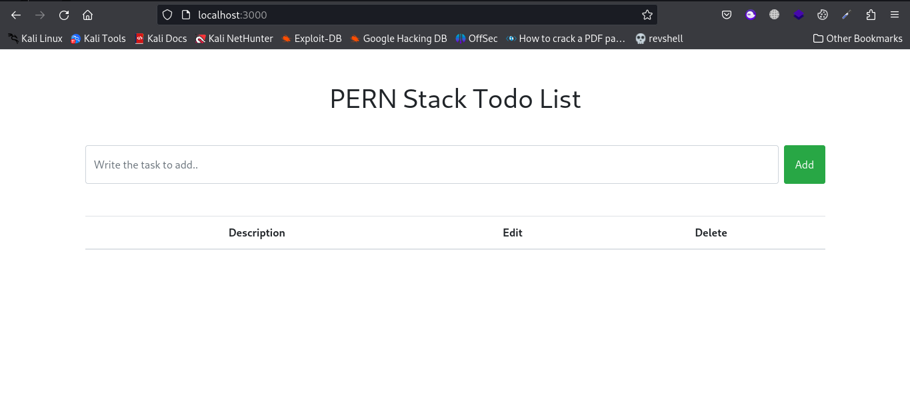
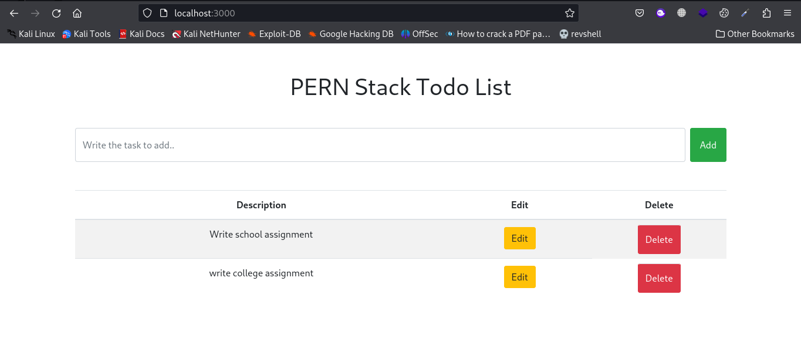
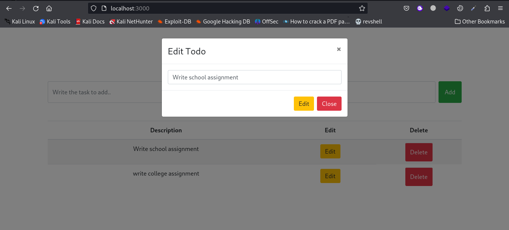

# PERN STACK TODO

PERN stack todo, is a simple todo application which uses PostgresSQL, Expressjs, Reactjs, and Nodejs, its basically a crud app on PERN stack.

## View

# PERN STACK TODO

PERN stack todo, is a simple todo application which uses PostgresSQL, Expressjs, Reactjs, and Nodejs, its basically a crud app on PERN stack.

## Features
[+] Create Todo
[+] Delete Todo
[+] Edit Todo

## View

### Landing

### Added todo

### Edit Todo

